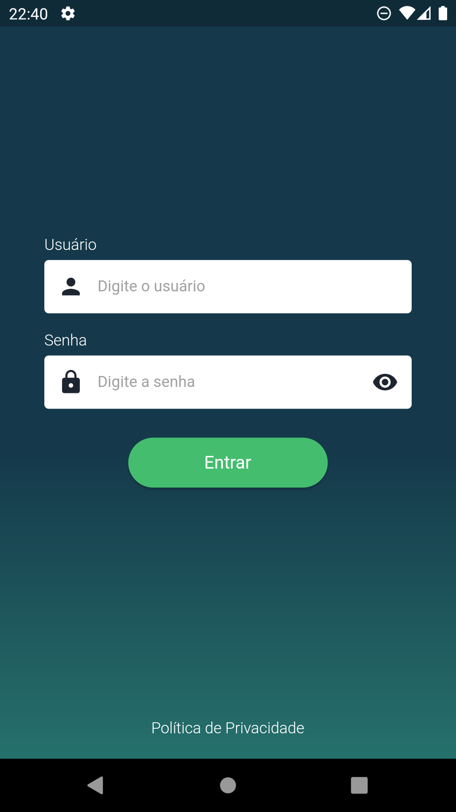
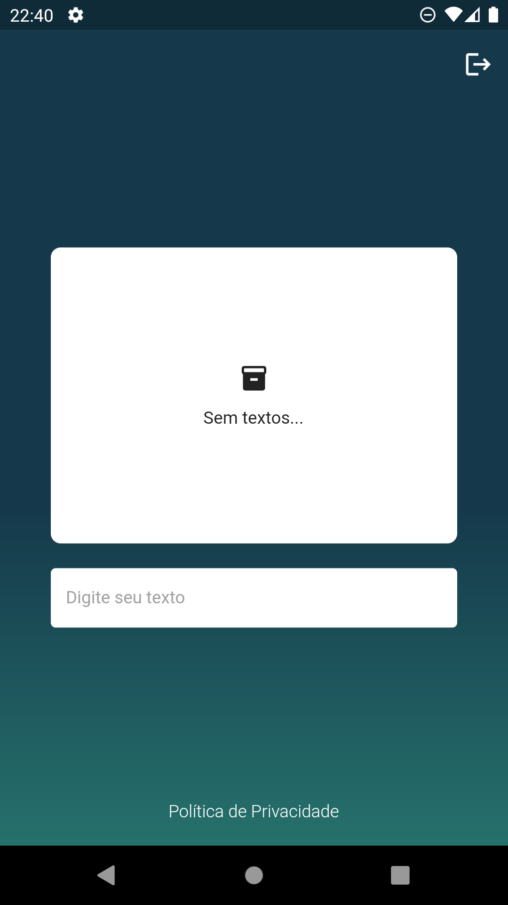

# App-Anotações

App com login via mock e bloco de anotações com shared preferences, utilizando mobx

## Índice

1. [Introdução](#introdução)
2. [Tecnologias](#tecnologias)
3. [Instruções](#instruções)
4. [Prints](#prints)

## Introdução
O app foi desenvolvido visando atender os seguintes requisitos
- Duas telas(Login e home)
- Utilização de estrutura de arquivos organizada
- Mobx para gerenciamento de estado
- Stores e repositories com cobertura de testes de unidade
## Tecnologias
>  Flutter (Mobile)

>  Notion (Organização e metas)

>  Material (Estilização)

> GetIt (Injeção de dependência)

> MobX (Gerenciamento de estados)

## Instruções
1. Certifique-se de ter o flutter 3.13.9 instalado, disponível em https://docs.flutter.dev/release/archive?tab=windows

2. Clone o projeto para a máquina local

3. No terminal na pasta raiz do projeto rode `flutter pub get` para sincronizar as dependências do projeto

4. Ainda no terminal, rode o comando `flutter run` para rodar o projeto

## Prints

    
    

